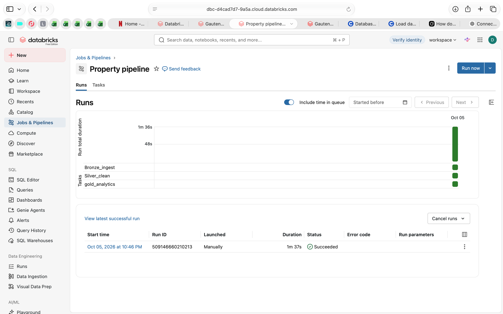

# Gauteng Property Lakehouse (Databricks)

An end-to-end data pipeline built on Databricks using the medallion
architecture (bronze, silver, gold), with a dashboard and an automated job.

> **Note:** The dataset is synthetic sample data, generated to resemble
> Gauteng property listings. It includes deliberate data quality problems
> so the cleaning step has real work to do. It is not real market data.

## Dashboard

## Architecture
Raw CSV -> Bronze (raw Delta table) -> Silver (cleaned) -> Gold (aggregated) -> Dashboard

## What each layer does

**Bronze** (`01_bronze_ingest.ipynb`)
Loads the raw CSV (615 rows) from a Unity Catalog volume into a Delta
table, unchanged.

**Silver** (`02_silver_clean.ipynb`)
- Removes 15 duplicate listings (600 unique listings remain)
- Standardises suburb names (casing and stray whitespace)
- Parses prices written as text, such as "R 3 415 000", into numbers
- Converts "Studio" to 0 bedrooms and handles blank values
- Sets impossible prices (R1, R250 million) to NULL instead of deleting
  the listing

**Gold** (`03_gold_analytics.ipynb`)
Analytics-ready tables:
- `gold_suburb_summary`: listings, median price and average price per m2
  by suburb, including how many listings each median is based on
- `gold_price_by_type`: median price by suburb and property type
- `gold_monthly_listings`: new listings and median price per month

## Orchestration
A Databricks Job runs the three notebooks in sequence. Each task depends
on the one before it, so silver only runs if bronze succeeds, and gold
only runs if silver succeeds.

## Data quality decisions
- Missing and impossible prices are set to NULL so they don't distort
  medians, but the listings are kept for other counts.
- Medians (not averages) are used because property prices are skewed
  by high-value outliers.
- Gold tables report how many listings each figure is based on.

## Tech stack
Databricks Free Edition, Delta Lake, Unity Catalog, Spark SQL, PySpark,
Databricks Dashboards, Databricks Jobs

## How to reproduce
1. Create a free Databricks account (Free Edition)
2. Create a schema and volume, then upload `property_listings.csv`
3. Import the three notebooks and run them in order, or chain them in a Job
4. Build a dashboard on the gold tables
